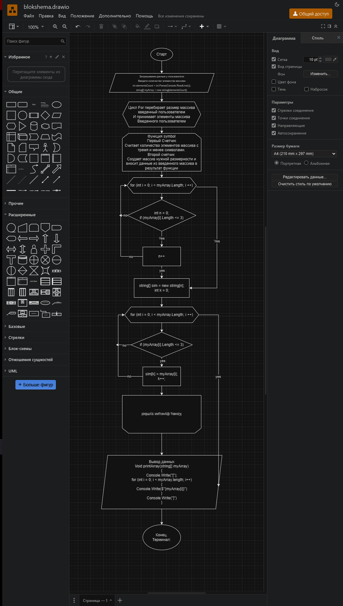

# Контрольная Работа.

## Описываю решение задачи:
> Задача: Написать программу, которая из имеющегося массива строк формирует новый массив из строк, длина которых меньше, либо равна 3 символам.<br> Первоначальный массив можно ввести с клавиатуры, либо задать на старте выполнения алгоритма.<br> При решении не рекомендуется пользоваться коллекциями, лучше обойтись исключительно массивами.

## Решение задачи.
### Первый Этап "Переменные, размер массива".
> 1.Для начала нам нужно создать переменные с выводом сообщения для пользовотеля. 
<br>2. Дальше создаем переменную для принятия кол-во элементов массива от пользователя. 
<br>3. Создаем массив. 
<br>4. Если кратко, то пользователь задал размер массива.
```
Console.Write("Введите количество элементов массива: ");
int elementsCount = int.Parse(Console.ReadLine());
string[] myArray = new string[elementsCount];
```
### Второй этап "Цикл, заполнения массива".
> 1.Создаем цикл **(for - счетчик)**
<br>2. Просим пользователя заполнить массив.
<br>3. Счетчик работает исходя из заданного размера массива пользователем.
<br>4. Задача пользователя заполнить массив любыми символами или словами.
```
void array(string[] myArray)
{
    for (int i = 0; i < myArray.Length; i++)
    {
        Console.Write($"\nВведите элемент массива под индексом {i + 1}:");
        myArray[i] = Console.ReadLine();
    }
}
```
### Третий этап "Функция **symbol**"
> 1.Самый первый цикл **for** перебирает массив и считает кол-во элементов массива с тремя и менее символами.
<br>2. Второй цикл **for** создает массив нужной размерностью и вносит данные из введенного массива в результат функсции.
<br>3. Функции **if** проверяют верны ли условия.
```
string[] symbol(string[] myArray)
{
    int n = 0;
    for (int i = 0; i < myArray.Length; i++)
    {
        if (myArray[i].Length <= 3)
        {
            n++;
        }
    }
    string[] sim = new string[n];
    int k = 0;
    for (int i = 0; i < myArray.Length; i++)
    {
        if (myArray[i].Length <= 3)
        {
            sim[k] = myArray[i];
            k++;
        }
    }
    return sim;
}
```
### Четвертый этап "Выводим массив исходя из ТЗ"
> 1. Выводим Скобки как указано в ТЗ
<br>2.Создаем счетчик для вывода массива
<br>3.Вызываем функции т.к. без них не будет работать выше указаный код.
```
void PrintArray(string[] myArray)
{
    Console.Write("[");
    for (int i = 0; i < myArray.Length; i++)
    {
        Console.Write($"{myArray[i]}");
    }
    Console.Write("]");
}
array(myArray);
PrintArray(symbol(myArray));
```
### Пятый этап "ПоЛнЫй КоД"
```
using System.Linq.Expressions;

class Program
{
    static void Main(string[] args)
    {
        Console.Write("Введите количество элементов массива: ");
        int elementsCount = int.Parse(Console.ReadLine());
        string[] myArray = new string[elementsCount];

        void array(string[] myArray)
        {
            for (int i = 0; i < myArray.Length; i++)
            {
                Console.Write($"\nВведите элемент массива под индексом {i + 1}:");
                myArray[i] = Console.ReadLine();
            }
        }
        string[] symbol(string[] myArray)
        {
            int n = 0;
            for (int i = 0; i < myArray.Length; i++)
            {
                if (myArray[i].Length <= 3)
                {
                    n++;
                }
            }
            string[] sim = new string[n];
            int k = 0;
            for (int i = 0; i < myArray.Length; i++)
            {
                if (myArray[i].Length <= 3)
                {
                    sim[k] = myArray[i];
                    k++;
                }
            }
            return sim;

        }
        void PrintArray(string[] myArray)
        {
            Console.Write("[");
            for (int i = 0; i < myArray.Length; i++)
            {
                Console.Write($"{myArray[i]}");
            }
            Console.Write("]");
        }
        array(myArray);
        PrintArray(symbol(myArray));
    }
}
```



Ссылка на GitHub [github] (https://github.com/SergeiLennikov/ControlWork "Нажми на меня")